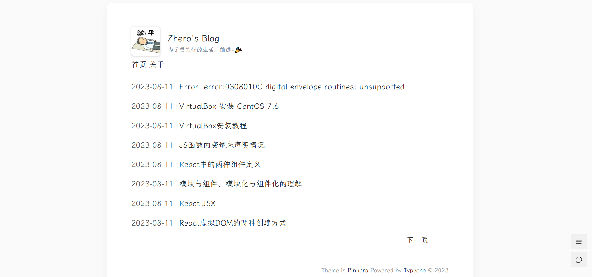

# Pinhero

一款极简 Typecho 博客主题

## 主题介绍

Pinhero 是一款极简的 Typecho 主题，简约但不简单。主题命名取自作者姓名和其女朋友姓名的最后一个字的英文，纠结于 Pinhero 还是 Heropin ，最后取为 Pinhero，意为一切都是Pin先Hero后，即要听女朋友的话。

## 下载地址

[https://github.com/zhero/pinhero](https://github.com/zhero/pinhero)

## 主题预览

[http://www.zhero.me](http://www.zhero.me)

## TODO

> 目前仍有许多部分功能不完善，暂时没时间做，后面继续迭代。

- 分类、标签、归档、搜索
- 文章页目录
- 夜间模式
- 社交账户展示
- 访问量统计
- 全站 Pjax
- 文章排版
- 百度收录查询 + 主动推送
- ……

## 赞助

如果你觉得这个主题不错，你可以帮作者买一杯果汁表示鼓励 🍹。（赞助的时候记得加上备注 😁）

## License

[MIT](https://opensource.org/licenses/MIT)

Copyright (c) 2023-present, Zhero